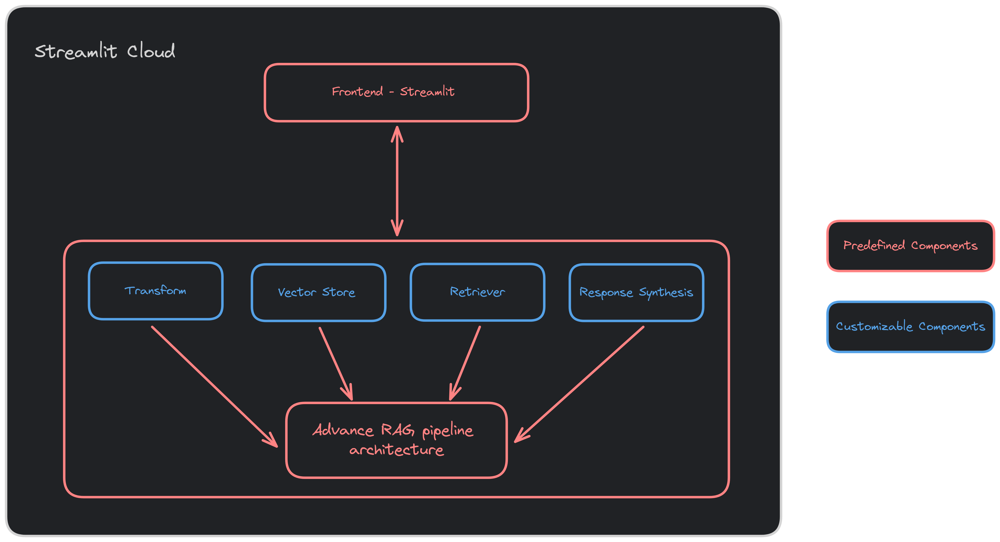

# FlowRAG
A web based GUI tool to create advanced RAG pipelines.

Live Demo: [FlowRAG](https://flowrag.streamlit.app/)

## Description
You can use this tool for two main purposes:
- Quickly setup a chatbot based on a specfic RAG pipeline architechture(with limited customization) over your data.
- Get an end-to-end implementation code of an advanced RAG pipeline and customize each indvidual components of it as per your wish.

This is a developer centric tool. It is meant to be used by developers/enthusiasts to quickly setup a complex RAG pipeline over their data and run test/eval on them.


## Architecture



We have build the RAG pipelines using llama-index and langchain libraries.

The pipeline has some customizable components and some fixed components. While configuring the pipeline, you can customize these components as per your requirements.
Once you are done with the configuration, you can download the pipeline code and the pipeline configuration file which will help in reproducing the same pipeline later point of time. 


## Avaiable RAG Pipelines

- [Sub Question Querying](https://docs.llamaindex.ai/en/stable/examples/query_engine/sub_question_query_engine.html)
- [Reciprocal Rerank Fusion Retriever](https://docs.llamaindex.ai/en/stable/examples/retrievers/reciprocal_rerank_fusion.html)

## Installation

This project uses Poetry for dependency management. To install the project and use it locally, run:

```sh
poetry install
```

## Usage
To start the application, run:
```sh
streamlit run src/app.py
```

## TODO
- [ ] Add download button to download the generated pipeline and pipeline config.
- [ ] Restructure util file, use class based approach rather than functions.
- [ ] Add options to customize the pipeline components (splitter, vector store, and etc)
- [ ] Add more RAG pipelines.

## Contributing

We welcome contributions to FlowRAG! Here's how you can help:

### Reporting Issues

If you find a bug or would like to request a new feature, please [create a new issue](https://github.com/Inamul-Hassan/FlowRAG/issues/ew) on our GitHub repository.

### Submitting a Pull Request

We would like you to add more RAG pipelines to the tool or knock out any of the action items in the TODO. To do this, follow these steps:

1. Fork the repository on GitHub.
2. Clone your forked repository to your local machine.
3. Make your changes and commit them to your forked repository.
4. Push your changes to your fork.
5. Submit a pull request to the main repository.

Please make sure your code adheres to our coding standards. We also recommend including unit tests with your pull request.


## Contributors

| <br/> | <br/> |
| :---: | :---: |
| [Inamul Hassan](https://github.com/Inamul-Hassan)  | [Vishal S R](https://github.com/vishal-sr) |

